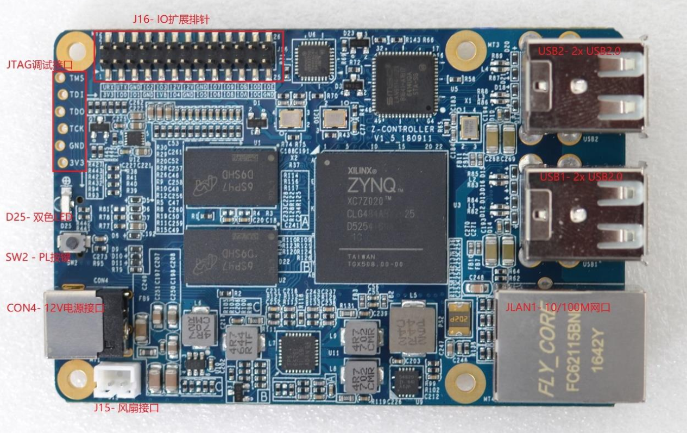

Lychee Sugar Hex
========

**Development board mainly contains:**

* FPGA: Zynq XC7Z020
* NAND Flash: 2Gb
* LPDDR3: 1GB
* 100M network port: x1
* USB 2.0: x4
* TF card slot: x1

 

**Main chip introduction:**

* Main chip: XC7Z020-1CLG484

The Zynq®-7000 SoC family integrates the software programmability of the ARM® processor with the hardware programmability of the FPGA for not only critical analysis and hardware acceleration, but also high CPU, DSP, ASSP and mixed-signal functions on a single device .
This development board uses chip specific features:
  * PS section:
Cortex-A9, dual core 667MHz, L1: 32KB instruction space, 32KB data space per core, L2: 512KB on-chip memory space 256KB.
  * PL part:
Artix-7 FPGA, programmable logic unit: 85K,
LUTs: 53200, Block RAM: 4.9Mb

* Memory chip: MT41K256M16TW-107

Capacity: 512MB; 32Meg x 16 x8 banks.
DDR3L SDRAM (1.35V), upward compatible 1.5V

* NAND FLASH memory chip: MT29F2G08ABAEAWP

* ONFI 1.0 interface standard
* SLC technology
* Structure:
  Page size x8
  2112 bytes (2048+64bytes)
  Block size
  64 pages (128K + 4K bytes)
  Plane size
  2 planes x 1024 blocks per plane
  Device size
  2Gb: 2048 blocks

* ULPI Bridge: USB3320C

  The USB3320 is a highly integrated, full-featured Hi-Speed ​​USB 2.0 transceiver based on the Microchip ULPI interface.
  2.1.5 USB HUB & 10/100 NIC chip: LAN9514-JZX
  USB Hub:
  1 x upstream USB2.0 PHY, 4 x downstream USB2.0 PHY

* NIC:
  Integrated MAC and PHY with support for 10BASE-T and 100BASE-TX

## Docs & Downloads

* [Information](http://dl.sipeed.com/TANG/Hex/)

